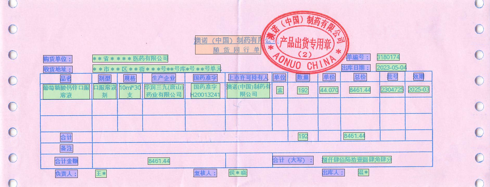
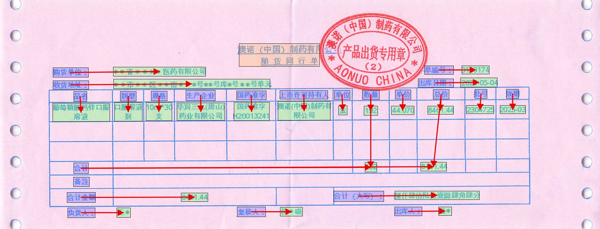
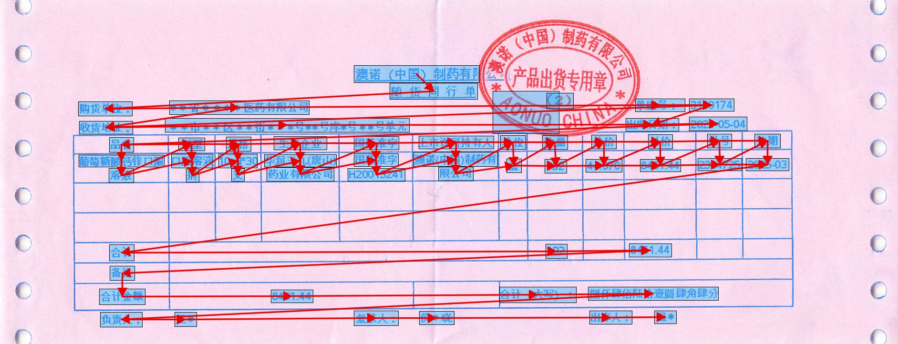

# PharmaShip: An Entity-Centric, Reading-Order-Supervised Benchmark for Chinese Pharmaceutical Shipping Documents

### Description

**PharmaShip** is a real-world Chinese dataset of scanned pharmaceutical shipping documents designed to stress-test pre-trained text-layout models under noisy OCR and heterogeneous templates.

It covers three complementary tasks:

* **Sequence Entity Recognition (SER)**
* **Relation Extraction (RE)**
* **Reading Order Prediction (ROP)**

PharmaShip adopts an **entity-centric** evaluation protocol to minimize confounds across architectures and incorporates a directed acyclic reading order graph to capture layout-induced reading strategies.

**Annotation Format Note:** The annotation format of PharmaShip is adapted from  **ROOR-Datasets** . For detailed specifications of the annotation structure, please refer to the [official ROOR-Datasets repository](https://github.com/chongzhangFDU/ROOR-Datasets "null").

### Dataset Examples

PharmaShip contains scanned documents with complex tabular layouts, stamps, and handwritten text. We provide fine-grained annotations at the token, entity, and relation levels, as well as reading order supervision.

| Task / View                                                                                            | Visualization                                                                 |
| ------------------------------------------------------------------------------------------------------ | ----------------------------------------------------------------------------- |
| **Token-level Annotation** <br>(Visualization of token-level ground truth)                   |                           |
| **Entity-level Annotation** <br>(Semantic entities annotated at the segment level)           |                        |
| **Relation Extraction (RE)**<br>(Linkage between entities, e.g., Question-Answer pairs)      |                              |
| **Reading Order Prediction (ROP)**<br>(DAG-based reading order based on relation extraction) |  |

### Dataset Statistics

PharmaShip consists of **161** annotated scanned documents with **11,295** segments. The dataset is officially split into 128 samples for training and 33 samples for validation.

Compared to existing datasets like FUNSD, CORD, and SROIE, PharmaShip features a higher density of entities and relations per sample, making it a more challenging benchmark for layout-intensive scenarios.

**Table I:** Statistics of PharmaShip, ROOR, FUNSD, CORD, and SROIE, including words, segments, entities, relation pairs, and the presence/strength of reading-order supervision.


### Benchmark Results

We benchmarked five representative baselines:  **LiLT** ,  **LayoutLMv3** ,  **GeoLayoutLM** , and their **RORE (Reading-Order-Relation Enhanced)** variants.

The experiments demonstrate that injecting reading-order-oriented regularization consistently improves performance on SER and Entity Linking (EL) tasks.

**Table II:** Performance comparison of different models on SER, EL, and ROP tasks.


*Note: Improvements (↑) denote F1 gains of RORE-enhanced variants. *The RORE enhancement implementation is adapted from *[*ROOR*](https://www.google.com/url?sa=E&source=gmail&q=https://github.com/chongzhangFDU/ROOR "null")*.**

### Download

You can download the full PharmaShip dataset from the link below:

🔗 [**Download PharmaShip Dataset**](https://1drv.ms/u/c/f06402be9f91dc9e/EY6Xzr0c3fVIpb93RidI0NoBfRG3WyrdufkR_7Cv3Y2Hpw)

**Note:** The PharmaShip dataset can only be used for non-commercial research purpose.

<!-- ### Citation

If you find this dataset helpful for your research, please cite our paper:

```
@inproceedings{pharmaship2024,
  title={PharmaShip: An Entity-Centric, Reading-Order-Supervised Benchmark for Chinese Pharmaceutical Shipping Documents},
  author={Tingwei Xie, Tianyi Zhou, Yonghong Song},
  booktitle={Proceedings of IEEE Conference},
  year={2024},
  note={To be updated}
}
```
-->

### Contact

For any questions regarding the dataset or the paper, please contact: [kevinxie@stu.xjtu.edu.cn](mailto:kevinxie@stu.xjtu.edu.cn) or [songyh@xjtu.edu.cn](mailto:songyh@xjtu.edu.cn), *School of Software Engineering, Xi'an Jiaotong University, Xi'an, China*
